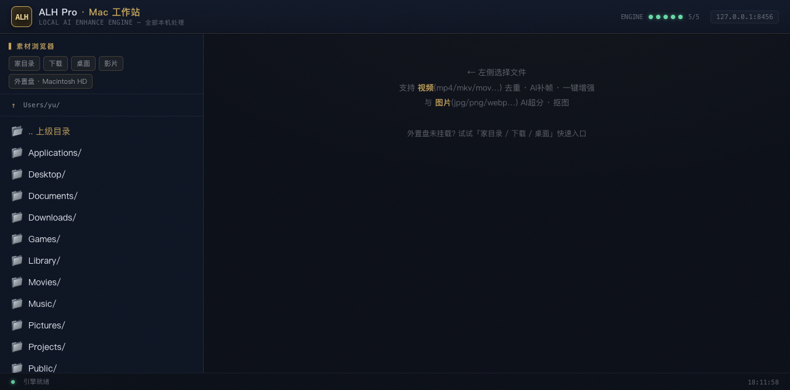

# ALH Pro Mac — macOS 本地 AI 视频/图片增强工作台

在 macOS 上开箱即用的本地 AI 增强工具链 + 图形界面（工作站）。
灵感来自 [ALH Pro](https://github.com/AlLHHH/ALH-Pro)（Windows 专属），本仓库是在 Mac 上的**独立实现**：
全部引擎与代码均为可免费获取的开源组件，不含 ALH Pro 的任何代码。

**所有处理在本机完成，不上传任何数据。** 中文界面。

| 功能 | 引擎 | 说明 |
|---|---|---|
| 图片 AI 超分 | Real-ESRGAN / waifu2x (ncnn-vulkan) | 写实 4x / 动漫 2x |
| AI 抠图 | rembg (U²-Net/ISNet/BiRefNet) | 一键去背景 |
| 视频去重 | 自研检测 (scripts/dedup.py) | 识别「拍二/拍三」重复帧 |
| 视频 AI 补帧 | RIFE (ncnn-vulkan) | 2x/4x/8x，保留音频 |
| 视频 AI 超分 | Real-ESRGAN 逐帧 | 480p → 1080p/2K |

## 🖥 图形界面（推荐）



```bash
./启动ALH工作站.command        # 双击运行 → 自动起服务 + 打开浏览器
# 浏览器访问 http://127.0.0.1:8456
```

- 左侧素材浏览器（自动发现外置盘 /Volumes/*）
- 视频：体检（重复帧报告+建议）→ 一键增强(去重+补帧) / 仅去重 / 仅补帧 → 实时进度 → 播放对比
- 图片：AI 超分 / AI 抠图 → 结果预览
- 本地私有快捷入口：`local_roots.json`（已被 .gitignore 排除，不入库）

## ⚙️ 安装

需要：macOS (Apple Silicon / Intel)、[ffmpeg](https://ffmpeg.org)（`brew install ffmpeg`）、Python 3.11+。

```bash
# 1. 克隆到约定路径（代码内部按此路径解析引擎）
git clone https://github.com/<你的账号>/alh-pro-mac.git ~/Projects/alh-pro-mac
cd ~/Projects/alh-pro-mac

# 2. 下载引擎二进制 + 模型（约 1GB，来自官方 release，见 THIRD_PARTY_NOTICES）
./scripts/setup_engines.sh

# 3. Python 环境（抠图用 rembg）
python3 -m venv .venv
.venv/bin/pip install -r requirements.txt

# 4. (可选) CLI 全局命令
ln -s "$PWD/bin/alh" ~/bin/alh
```

引擎也可手动下载解压到 `engines/`，目录结构见 `scripts/setup_engines.sh`。

## 🔧 CLI 速查

```bash
alh probe <video>                    # 视频体检: 真实内容帧率/重复帧节奏
alh dedup <video> -o out.mp4         # 去除重复帧(拍二/拍三) → 纯内容帧
alh rife  <video> -x 4 -o out.mp4    # RIFE 补帧 (2/4/8 倍, 保留音频)
alh pipe  <video> -o out.mp4 --target 60   # 去重→补帧 一键
alh img-up  -s 4 [--anime] [--jpg]    # 图片 AI 超分
alh img-rmbg  [-m u2net] [-a]         # 图片 AI 抠图
```

## 🎯 典型用法：动漫/3D 视频平滑化

动漫/3D 视频常是「一拍二/一拍三」输出（30fps 文件实际只有 15fps 内容，每帧重复 2 次）。
直接补帧会产生粘滞感；**先去重再补帧**才顺滑：

```bash
alh probe 你的视频.mp4     # 看报告: 重复率~50% + 节奏 {2: N} = 拍二片源
alh pipe 你的视频.mp4 -o 平滑版.mp4 --target 60
```

## 🔬 去重原理

1. ffmpeg 解码为 160px 灰度代理帧流（快，内存友好）
2. 相邻帧 mean-abs-diff：帧复制 ≈0~0.3，真实运动通常 >0.8（阈值可调）
3. 输出节奏分布（每内容帧出现次数：2=拍二 3=拍三）与去重视频（保留每段首帧）
4. 合成验证：拍二/拍三/无重复三类片源检测 100% 准确

## 📄 许可与致谢

- 本仓库编排代码（alh.py / dedup.py / ui/）：MIT License，见 [LICENSE](LICENSE)
- 引擎与模型版权归原作者，见 [THIRD_PARTY_NOTICES.txt](THIRD_PARTY_NOTICES.txt)
- FFmpeg 随系统安装（GPL）；本工具以独立子进程方式调用，未链接
